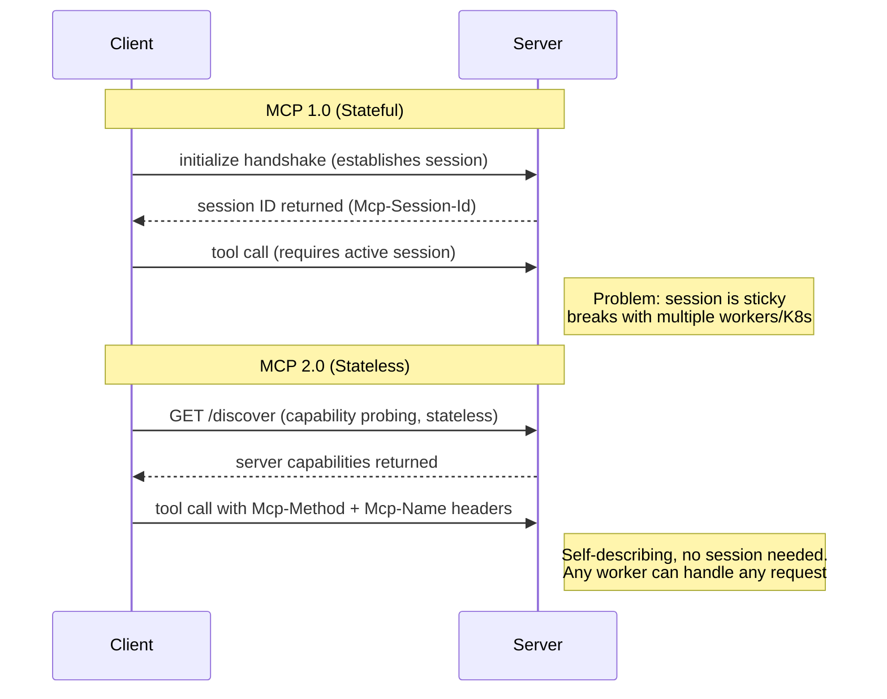

Sticky sessions and stateful handshakes are finally dead, meaning your MCP servers can now scale on [Kubernetes](https://kubernetes.io/docs/) without breaking [Gunicorn](https://gunicorn.org/). 

If you've been building with the [Model Context Protocol](https://modelcontextprotocol.io) over the last year, you know the pain of keeping sessions alive across multiple workers. With the release of MCP 2.0, those days are over. The protocol has fundamentally shifted to a stateless architecture, bringing enterprise-grade authentication and a modular extensions framework along with it.

Upgrade your servers using the `v1-to-v2` codemod today, and check out the [official MCP 2.0 migration docs](https://modelcontextprotocol.io/specification/2026-07-28/changelog) for edge cases.

> Model Context Protocol (MCP) is an open standard that lets AI models communicate with external tools and data sources through a unified interface.

## The Breaking Point: Why MCP 1.0 Couldn't Scale

Let's be honest: MCP 1.0's stateful design was a mistake for production use. The `initialize` handshake was a massive bottleneck. Relying on an `Mcp-Session-Id` and a stateful connection meant that deploying your servers in a serverless environment or a multi-worker Kubernetes setup was an absolute nightmare. If a worker died, the session died, and your AI client was left hanging.

Picture this: you have a standard setup behind an AWS Application Load Balancer routing traffic to three Gunicorn workers. The AI client sends an `initialize` request. Worker A handles it, creates a shiny new session in memory, and replies with an `Mcp-Session-Id`. A few milliseconds later, the client sends a `call_tool` request using that same ID. But the load balancer routes this second request to Worker B. Worker B has zero context about this session. It throws an error, the AI client panics, and the entire tool execution loop crashes. Sound familiar?

To fix this in MCP 1.0, you had to jump through burning hoops. You either pinned traffic with sticky sessions (killing your load balancer's efficiency) or dumped session state into Redis (adding network latency and infrastructure overhead to every single request). It was a frustrating experience for anyone trying to build production-grade AI tools.

And yes, pinning `mcp>=1.0.0` without an upper bound was a mistake we all made. We assumed the core protocol wouldn't change this drastically. But to scale, it had to.

## MCP 2.0 Core Spec Upgrades

> [!NOTE]
> This diagram illustrates the architectural shift from MCP 1.0's stateful session requirement, which struggles in multi-worker environments, to MCP 2.0's stateless, self-describing request model.



### A Stateless Core & `server/discover`

The biggest shift is replacing the stateful handshake with mandatory HTTP headers: `Mcp-Method` and `Mcp-Name`. Every request is now entirely self-describing. The server doesn't assume any prior connection state. Load balancers can finally do their jobs properly. 

Need to know what a server can do? There's a new `server/discover` RPC specifically for capability probing.

Here is what the shift looks like in practice:

```diff
- # MCP 1.0 Stateful Session
- session = server.initialize(client_info)
- server.register_session(session.id)
- 
- @server.on_request
- def handle(req):
-     session = server.get_session(req.headers['Mcp-Session-Id'])
-     # Handle statefully
+ # MCP 2.0 Stateless Core
+ @server.on_request
+ def handle(req):
+     method = req.headers['Mcp-Method']
+     name = req.headers['Mcp-Name']
+     # Context is passed explicitly; no session state needed
```

### Multi Round-Trip Requests (MRTR) Demystified

Handling complex async flows used to require a held-open session. MCP 2.0 introduces Multi Round-Trip Requests (MRTR) to solve this elegantly without tying up server resources.

Think of it like an async back-and-forth email thread versus a phone call you can't hang up. In MCP 1.0, asking an AI to query a massive database meant holding the phone line open. You kept the session alive and blocked the worker while you waited for the long-running process to finish. 

With MRTR, you send an email and walk away. When the client makes a multi-step tool call, the server immediately returns a state token instead of waiting for the final result. The client can then use that token in subsequent requests to check progress, provide additional parameters, or pull the final data. 

For example, imagine a tool that triggers a 5-minute data pipeline run. Under MRTR, the server fires off the pipeline and hands back a job token. The stateless worker is instantly freed up to handle other traffic. The AI client later sends a new request with that job token to ask, "Is it done yet?" Any worker can receive that check, read the token, look up the job status, and reply. It's cleaner, more resilient, and won't block your event loop.

### Enterprise Auth: CIMD Replaces DCR

Authentication got a serious, grown-up upgrade. OAuth Dynamic Client Registration (DCR) is out. Client ID Metadata Documents (CIMD) are in. 

Why did we ditch DCR? In practice, DCR was incredibly fragile and overly complex for the typical AI agent use case. It required the client to actively register itself with the Authorization Server and negotiate credentials on the fly, which led to a nightmare of state management and race conditions when multiple agents spun up simultaneously. It also gave IT security teams heartburn because it meant allowing unverified clients to provision themselves.

CIMD flips this dynamic. Instead of dynamic registration, the client simply publishes a static metadata document (typically a JSON file hosted on a well-known URL) that describes its identity, required scopes, and public keys. The Authorization Server just reads this document. There is no complex registration handshake to maintain. 

By aligning tightly with [OAuth 2.0](https://datatracker.ietf.org/doc/html/rfc6749) and [OIDC](https://openid.net/specs/openid-connect-core-1_0.html), and enforcing [RFC 9207](https://datatracker.ietf.org/doc/html/rfc9207) issuer validation, MCP 2.0 makes integration a breeze. Why does this matter? Your enterprise Identity Providers like Okta and Entra now work natively without hacky middleware workarounds. Security teams can easily audit the CIMD files, and developers get to skip the headache of DCR state management.

### The Extensions Framework: Tasks & MCP Apps

Not every feature belongs in the core spec. MCP 2.0 introduces an Extensions Framework that lets ecosystem features evolve independently.

- **Tasks**: Standardized, long-running async operations that won't timeout your basic RPC calls.
- **MCP Apps**: Server-rendered UI components (think forms and charts) that render directly inside your AI chat interfaces.

No more core-spec churn every time we want a new UI feature.

## Surviving the Migration

### Running the `v1-to-v2` Codemod

Migrating doesn't have to mean rewriting everything from scratch. The community has provided an [official codemod](https://www.npmjs.com/package/@modelcontextprotocol/codemod) that handles the bulk of the tedious work.

```bash
npx @modelcontextprotocol/codemod@beta v1-to-v2
```

This tool automatically upgrades your dependency versions, rewrites import paths, and updates basic syntax. However, it's not magic. You will still need manual attention for complex logic. 

#### Manual Changes Checklist

Here is exactly what the codemod *won't* do for you, and what you'll need to fix by hand:

- **Stateful in-memory caches**: If your tools relied on global variables or `mcp_session` objects to store state between calls, you must refactor these to use external stores (like Redis) or pass state explicitly via MRTR tokens.
- **Custom Authentication Middleware**: If you built custom DCR handlers for MCP 1.0, you have to rip them out completely and replace them with static CIMD endpoints.
- **Connection Lifecycle Hooks**: Remove any `@server.on_connect` or `@server.on_disconnect` event listeners. Since the connection is stateless, these lifecycle events no longer exist.
- **Long-running synchronous tools**: You need to manually refactor these into asynchronous Tasks using the new Extensions Framework so they don't block the stateless request flow.

Tackling this checklist early will save you hours of debugging weird race conditions later.

### Python & TypeScript SDK Breaking Changes

If you're writing Python (especially using [FastMCP](https://github.com/jlowin/fastmcp)), prepare for some structural changes. The SDK has been reorganized to match the new spec.

```python
# Before (MCP 1.0)
from mcp.server.fastmcp import FastMCP
from mcp.shared.exceptions import McpError, ErrorData

server = FastMCP("my-server")

@server.list_tools()
def my_tool(inputSchema: dict):
    raise McpError(ErrorData(code=400, message="Bad"))

# After (MCP 2.0)
from mcp.server.mcpserver import MCPServer
from mcp.shared.exceptions import MCPError

server = MCPServer("my-server", tools=[my_tool])

def my_tool(input_schema: dict):
    raise MCPError(code=400, message="Bad")
```

Key things to note:
- `mcp.server.fastmcp` is now `mcp.server.mcpserver`.
- `McpError` became `MCPError`, and the nested `ErrorData` object is gone in favor of direct `code` and `message` arguments.
- The `@server.list_tools()` decorator is history. Use constructor-based callbacks instead.
- Schema properties shifted from `camelCase` to `snake_case` (`inputSchema` -> `input_schema`).

It's the classic v2 cleanup. Just remember to pin your dependencies with upper bounds this time: `mcp>=2.0.0,<3.0.0`. Remember the last time your CI broke because of a transitive dependency? Let's avoid that.

Don't panic if you have legacy clients. Existing connections remain valid under a 12-month minimum deprecation window, giving you plenty of time to roll out your updates.

## Frequently Asked Questions

### Is MCP 2.0 backward compatible with MCP 1.0?
Existing MCP 1.0 connections remain valid under a 12-month minimum deprecation window, giving you plenty of time to roll out your client updates.

### What is the easiest way to migrate from MCP 1.0 to 2.0?
The easiest way is to run the official `v1-to-v2` codemod, which automatically upgrades dependency versions, rewrites import paths, and updates basic syntax.

### Why did MCP remove the `initialize` handshake?
The stateful `initialize` handshake was a massive bottleneck that prevented scaling in serverless environments or multi-worker Kubernetes setups. MCP 2.0 replaces this with a stateless, self-describing request model.

### What are MCP Apps and Tasks in MCP 2.0?
Tasks are standardized, long-running async operations, while MCP Apps are server-rendered UI components that render directly inside your AI chat interfaces.

## Time to Make the Jump

The shift to MCP 2.0 might feel like a heavy lift today, but the architectural payoff is massive. Shedding the stateful handshake means you can finally treat your AI tooling like any other modern, scalable web service. You get cheaper deployments, zero dropped sessions on worker reboots, and enterprise auth that security teams actually trust. 

Grab the codemod, update those SDKs, and start refactoring. Your future self will thank you. Your on-call engineers will too, when that next massive wave of AI agent traffic hits your servers without breaking a sweat. If you run into weird edge cases, drop a comment below or open an issue on the official protocol repo. Let's build something scalable.
