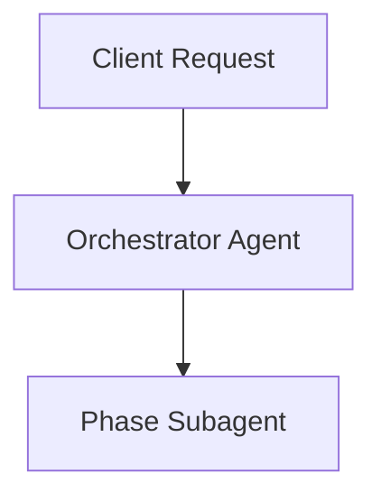

# End-to-End Blog Workflow & Skills Architecture

This document specifies the agentic blogging workflow for `apps/blog` in this monorepo. It details the 7-phase pipeline, local skill dependencies, subagent delegation model, and Velite MDX publication requirements.

---

## 1. Overview & Goal

The target of this workflow is to produce high-quality, SEO/GEO-optimized blog posts target-hosted at `apps/blog/content/posts/<slug>.mdx`.

To prevent context bloat and ensure high expertise at each step, the workflow uses an **Orchestrator-Subagent** model: a primary orchestrator spawns isolated subagents for each of the 7 sequential phases of content creation.

---

## 2. Local Skill Registry

All skills for this workflow are installed locally in the project repository under `.agents/skills/` (no global installation required):

| Phase       | Phase Name                          | Primary Local Skills (`.agents/skills/`)                    | Description                                                                                                                                                                     |
| :---------- | :---------------------------------- | :---------------------------------------------------------- | :------------------------------------------------------------------------------------------------------------------------------------------------------------------------------ |
| **Phase 1** | Brand Strategy & Context            | `product-marketing`, `content-strategy`                     | Grounds content in product positioning, target audience personas, and value propositions.                                                                                       |
| **Phase 2** | Keyword Research & Briefing         | `keyword-research`, `keyword-clustering`, `find-keywords`   | Pulls search volume/intent data, clusters topics, and creates an editor-ready brief.                                                                                            |
| **Phase 3** | Content Drafting                    | `blog`, `blog-writing-guide`, `velite`                      | Multi-agent drafting using built-in article templates and Velite MDX schema standards.                                                                                          |
| **Phase 4** | Visual Media & Diagram Architecture | `design-doc-mermaid`, `mermaid-diagrams`, `diagram-creator` | Analyzes Phase 3 article text to identify visualization opportunities, architecting mandatory educational Mermaid flowcharts, technical schematics, and AI generation callouts. |

| **Phase 5** | SEO & GEO Optimization | `ai-seo`, `seo` | Optimizes post for Google SEO and Generative Answer Surfaces (Perplexity, ChatGPT, AI Overviews). |
| **Phase 6** | Technical Audit & Build | `seo`, `velite` | Validates Core Web Vitals, HTML semantic markup, and verifies `.velite` MDX compilation. |
| **Phase 7** | Distribution | `copywriting`, `social`, `twitter-algorithm-optimizer` | Repurposes the blog post into X/LinkedIn posts, newsletters, and promotional copy. |

---

## 3. Subagent Execution Policy

To ensure high output quality and prevent context rot, **subagents MUST be created for each task/phase**:

1. **Context Isolation**: Each phase subagent runs in its own context window.
2. **Structured Handoff**: Each subagent returns a concise JSON or Markdown artifact (Brief, Outline, Draft, Audit Report) to the main orchestrator.
3. **No Direct State Mutation**: Subagents only edit files or write outputs under `apps/blog/content/posts/` when explicitly assigned in Phase 3 or Phase 4.

---

## 4. Blog Post Publication & Schema (`apps/blog`)

All blog posts are rendered via **Velite** in `apps/blog`. Generated posts must be saved as MDX files at `apps/blog/content/posts/<slug>.mdx` and strictly adhere to the schema in `apps/blog/velite.config.ts`:

```mdx
---
title: 'Article Title (Max 99 characters)'
description: 'Compelling summary for SEO (Max 999 characters)'
date: 'YYYY-MM-DD'
published: true
tags: ['Technology', 'AI', 'Engineering']
cover: './cover-image.jpg' # Optional
---

## Introduction

Post content written in clean GitHub Flavored MDX...
```

### Visual Media & Diagram Requirements

Every generated blog post **MUST contain at least one visual asset** (such as an architecture diagram, flow chart, data comparison chart, or technical schematic) designed to help the reader understand a core concept.

1. **Mandatory Minimum**: Every post MUST include at least 1 visual element (Mermaid diagram, technical diagram placeholder, or conceptual schematic).
2. **Pedagogical Relevance (No Random Filler)**: The visual asset must be directly contextual and educational—explaining data flow, architecture layers, state machines, or complex technical relationships. Random stock photos or decorative fillers are strictly prohibited.
3. **AI Generation Warning Callout**: Wrap every visual element in a warning callout instructing the user to render/generate the final visual asset using an AI image/diagram generation agent:

````mdx
> [!WARNING]
> **AI Asset Generation Required**: The diagram/image below is a conceptual placeholder designed to illustrate the system architecture. Use an AI image generation agent (e.g., DALL-E, Midjourney, Imagen) or Mermaid renderer to generate and place the final visual asset.


````

````


### Verification

After creating or editing a post:

- Run `bun --filter blog dev` or `bun run lint` to verify that `.velite` generates content without type errors.

---

## 5. Workflow Command

The entire 6-phase pipeline can be invoked via the `.agents/skills/blog-workflow` skill:

```bash
# Example invocation prompt for the AI agent
"Execute the blog-workflow skill for topic: 'Building Modern AI Agent Pipelines with Bun and Turborepo'"
````
