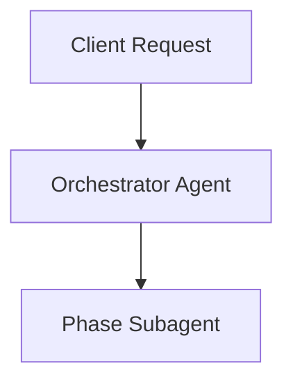

# End-to-End Blog Workflow & Skills Architecture

This document specifies the agentic blogging workflow for `apps/blog` in this monorepo. It details the 7-phase pipeline, local skill dependencies, subagent delegation model, and Velite MDX publication requirements.

---

## 1. Overview & Goal

The target of this workflow is to produce high-quality, SEO/GEO-optimized blog posts target-hosted at `apps/blog/content/posts/<slug>.mdx`.

To prevent context bloat and ensure high expertise at each step, the workflow uses an **Orchestrator-Subagent** model: a primary orchestrator spawns isolated subagents for each of the 7 sequential phases of content creation.

---

## 2. Local Skill Registry

All skills for this workflow are installed locally in the project repository under `.agents/skills/` (no global installation required):

| **Phase 1** | Audience Persona & Strategy (Understanding the Reader) | `product-marketing`, `content-strategy` | Deeply analyzes reader personas (Tip 9) and identifies core problems to solve (Tip 11). Grounds content in brand positioning. |
| **Phase 2** | Pre-Draft Competitor Gap Analysis | `competitor-analysis` | Analyzes top 3-5 ranking articles for the topic to identify missing angles and generate a Gap Report. |
| **Phase 3** | Ideation, Story & SEO Briefing | `keyword-research`, `keyword-clustering`, `find-keywords` | Combines keyword data and Gap Report with narrative journey mapping (Tip 17). Brainstorms (Tip 18) to create an editor-ready brief focused on solving specific problems. |
| **Phase 4** | Human-Centric Drafting | `blog`, `blog-writing-guide`, `velite` | Drafts the MDX article focusing on storytelling (Tip 1), empathy (Tip 2), varied length (Tip 7), asking questions (Tip 16), and clear calls to action (Tip 10). |
| **Phase 5** | Visual Media & Diagram Architecture | `design-doc-mermaid`, `mermaid-diagrams`, `diagram-creator` | Analyzes Phase 4 draft to architect mandatory educational Mermaid flowcharts, technical schematics, and AI generation callouts. |
| **Phase 6** | Contextual Hyperlink Research & Verification | `research`, `search_web` | Identifies opportunities for solid, high-value hyperlinks. Researches and verifies each link to ensure it is accurate, relevant, and authoritative. Avoids excessive linking. |
| **Phase 7** | Fact-Checking & Claim Verification | `fact-checker` | Extracts technical claims and statistics from the draft, searching the web to verify authenticity and prevent hallucination. |
| **Phase 8** | Rigorous Editing & Quality Control | `blog-writing-guide`, `copywriting` | Dedicated editing phase (Tip 14) to refine flow, grammar, punctuation, and emotional resonance. QA checks all inserted hyperlinks for context and validity. |
| **Phase 9** | AI Slop Removal & Brand Voice | `content-deslop` | Scans the edited draft for known AI-isms ("delve", "tapestry") and forces rewrites for a punchier, authentic human brand voice. |
| **Phase 10**| GEO & SEO Optimization | `ai-seo`, `seo` | Optimizes post for Google SEO and Generative Answer Surfaces without losing the human voice. |
| **Phase 11**| Chief Editor Review Loop (FSM Router) | `chief-editor` | Pre-final QA phase. Suggests changes (e.g., missing tables, weak flow) routing the orchestrator back to earlier phases (Drafting, Visuals) up to 3 times before approval. |
| **Phase 12**| Technical Audit & Build | `seo`, `velite` | Validates Core Web Vitals, HTML semantic markup, verifies `.velite` MDX compilation, and ensures no broken links. |
| **Phase 13**| Social Distribution & Selective Publishing | `copywriting`, `twitter-algorithm-optimizer` | Repurposes the blog post into X/LinkedIn posts and newsletters. Emphasizes serving current readers over pure virality (Tip 19) and selective publishing (Tip 21). |

---

## 3. Subagent Execution Policy & Finite State Machine

To ensure high output quality and prevent context rot, the workflow operates as a **Finite State Machine (FSM)** rather than a simple unidirectional flow:

1. **Context Isolation**: Each phase subagent runs in its own context window.
2. **Original User Query Propagation**: The original user prompt/idea is treated as an immutable payload (`original_user_query`) passed down to EVERY subagent across all 13 phases.
3. **Strict Zero Internal Knowledge Policy**: Subagents for research, drafting, fact-checking, and auditing MUST NOT rely on model parametric memory for facts, stats, or technical specs. They MUST execute web searches for all claims.
4. **Official Documentation Citation Mandate**: Every factual or technical claim in the blog draft MUST be cited with an explicit Markdown link pointing to official documentation or a primary authoritative web source.
5. **Structured Handoff**: Each subagent returns a concise JSON or Markdown artifact to the main orchestrator.
6. **QC & Intent Drift Rejection**: The Phase 11 (Chief Editor / QC) subagent compares the final draft against the `original_user_query`. If the post has drifted away from the user's intended topic or lacks official links, it rejects the draft with `NEEDS REVISION`, routing back (up to 3 times).
7. **No Direct State Mutation**: Subagents only edit files or write outputs under `apps/blog/content/posts/` when explicitly assigned in their designated phase.

---

## 4. Blog Post Publication & Schema (`apps/blog`)

All blog posts are rendered via **Velite** in `apps/blog`. Generated posts must be saved as MDX files at `apps/blog/content/posts/<slug>.mdx` and strictly adhere to the schema in `apps/blog/velite.config.ts`:

```mdx
---
title: 'Article Title (Max 99 characters)'
description: 'Compelling summary for SEO (Max 999 characters)'
date: 'YYYY-MM-DD'
published: true
tags: ['Technology', 'AI', 'Engineering']
cover: './cover-image.jpg' # Optional
---

## Introduction

Post content written in clean GitHub Flavored MDX...
```

### Visual Media & Diagram Requirements

Every generated blog post **MUST contain at least one visual asset** (such as an architecture diagram, flow chart, data comparison chart, or technical schematic) designed to help the reader understand a core concept.

1. **Mandatory Minimum**: Every post MUST include at least 1 visual element (Mermaid diagram, technical diagram placeholder, or conceptual schematic).
2. **Pedagogical Relevance (No Random Filler)**: The visual asset must be directly contextual and educational—explaining data flow, architecture layers, state machines, or complex technical relationships. Random stock photos or decorative fillers are strictly prohibited.
3. **AI Generation Warning Callout**: Wrap every visual element in a warning callout instructing the user to render/generate the final visual asset using an AI image/diagram generation agent:

````mdx
> [!WARNING]
> **AI Asset Generation Required**: The diagram/image below is a conceptual placeholder designed to illustrate the system architecture. Use an AI image generation agent (e.g., DALL-E, Midjourney, Imagen) or Mermaid renderer to generate and place the final visual asset.


````

````


### Verification

After creating or editing a post:

- Run `bun --filter blog dev` or `bun run lint` to verify that `.velite` generates content without type errors.

---

## 5. Workflow Command

The entire 6-phase pipeline can be invoked via the `.agents/skills/blog-workflow` skill:

```bash
# Example invocation prompt for the AI agent
"Execute the blog-workflow skill for topic: 'Building Modern AI Agent Pipelines with Bun and Turborepo'"
````
